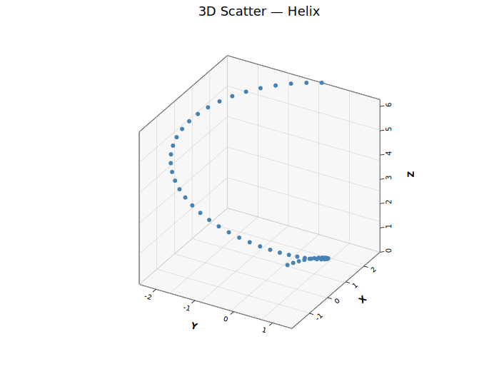
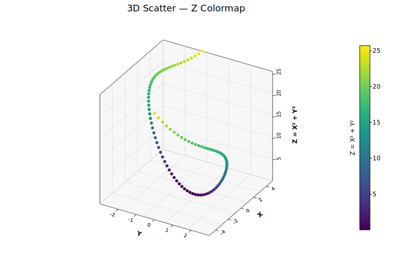
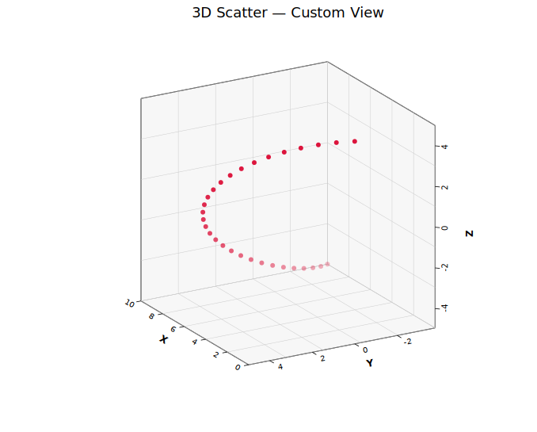

# 3D Scatter Plot

Renders 3D point data using orthographic projection with a depth-sorted painter's algorithm. Points are projected onto a 2D canvas with a matplotlib-style open-box wireframe, back-pane fills, and grid lines on all three back walls. Supports z-colormap coloring, depth shading, per-point colors and sizes, and six marker shapes.

**Import path:** `kuva::plot::scatter3d::Scatter3DPlot`

---

## Basic usage

Pass `(x, y, z)` tuples via `with_data()`:

```rust,no_run
use kuva::plot::scatter3d::Scatter3DPlot;
use kuva::backend::svg::SvgBackend;
use kuva::render::render::render_multiple;
use kuva::render::layout::Layout;
use kuva::render::plots::Plot;

let scatter = Scatter3DPlot::new()
    .with_data(vec![(1.0, 2.0, 3.0), (4.0, 5.0, 6.0), (7.0, 8.0, 9.0)])
    .with_color("steelblue")
    .with_x_label("X")
    .with_y_label("Y")
    .with_z_label("Z");

let plots = vec![Plot::Scatter3D(scatter)];
let layout = Layout::auto_from_plots(&plots).with_title("3D Scatter");

let scene = render_multiple(plots, layout);
let svg = SvgBackend.render_scene(&scene);
std::fs::write("scatter3d.svg", svg).unwrap();
```



---

## Z-colormap

Color points by their Z value using a colormap:

```rust,no_run
# use kuva::plot::scatter3d::Scatter3DPlot;
# use kuva::plot::heatmap::ColorMap;
let scatter = Scatter3DPlot::new()
    .with_data(vec![(1.0, 2.0, 3.0), (4.0, 5.0, 6.0)])
    .with_z_colormap(ColorMap::Viridis);
```



---

## Custom view angles

Adjust the camera position with azimuth and elevation:

```rust,no_run
# use kuva::plot::scatter3d::Scatter3DPlot;
let scatter = Scatter3DPlot::new()
    .with_data(vec![(1.0, 2.0, 3.0)])
    .with_azimuth(-120.0)
    .with_elevation(20.0)
    .with_depth_shade(true);
```



---

## Builder reference

| Method | Default | Description |
|---|---|---|
| `.with_data(iter)` | — | Set (x, y, z) data points |
| `.with_color(css)` | `"steelblue"` | Uniform point color |
| `.with_size(px)` | `3.0` | Marker radius |
| `.with_marker(shape)` | `Circle` | Marker shape (Circle, Square, Triangle, Diamond, Cross, Plus) |
| `.with_colors(iter)` | — | Per-point colors |
| `.with_sizes(vec)` | — | Per-point sizes |
| `.with_z_colormap(map)` | — | Color by Z value |
| `.with_depth_shade(bool)` | `false` | Fade distant points |
| `.with_marker_opacity(f)` | — | Fill opacity (0.0–1.0) |
| `.with_azimuth(deg)` | `-60.0` | Azimuth viewing angle |
| `.with_elevation(deg)` | `30.0` | Elevation viewing angle |
| `.with_x_label(s)` | — | X-axis label |
| `.with_y_label(s)` | — | Y-axis label |
| `.with_z_label(s)` | — | Z-axis label |
| `.with_show_grid(bool)` | `true` | Grid on back walls |
| `.with_show_box(bool)` | `true` | Wireframe box |
| `.with_grid_lines(n)` | `5` | Grid/tick divisions |
| `.with_z_axis_right(bool)` | `true` | Z-axis on right side |
| `.with_legend(s)` | — | Legend label |

---

## CLI

```bash
kuva scatter3d data.tsv --x x --y y --z z \
    --title "3D Scatter" --x-label "X" --y-label "Y" --z-label "Z"

kuva scatter3d data.tsv --x x --y y --z z --color-by group \
    --z-color viridis --depth-shade
```
