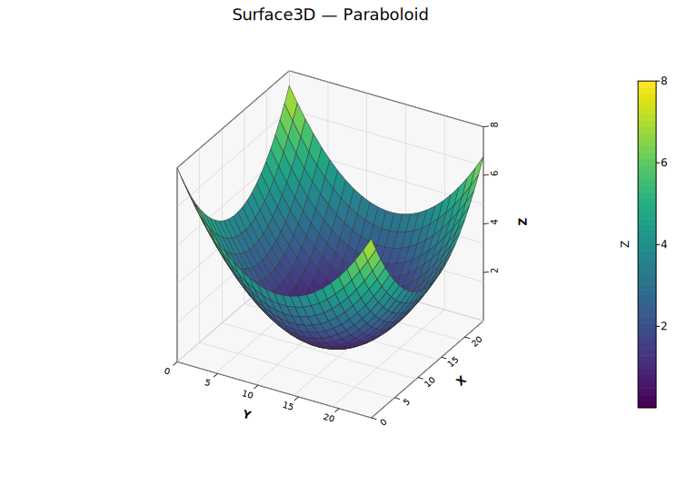
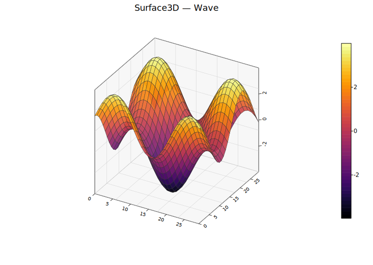

# 3D Surface Plot

Renders a 2D grid of Z values as a depth-sorted quadrilateral mesh with orthographic projection. Each grid cell becomes a filled quad, optionally colored by average Z value through a colormap. Uses the same open-box wireframe, back-pane fills, and rotated tick labels as the 3D scatter plot.

**Import path:** `kuva::plot::surface3d::Surface3DPlot`

---

## Basic usage

Pass a 2D grid of Z values:

```rust,no_run
use kuva::plot::surface3d::Surface3DPlot;
use kuva::plot::heatmap::ColorMap;
use kuva::backend::svg::SvgBackend;
use kuva::render::render::render_multiple;
use kuva::render::layout::Layout;
use kuva::render::plots::Plot;

let z_data: Vec<Vec<f64>> = (0..20).map(|i| {
    (0..20).map(|j| {
        let x = (i as f64 - 10.0) / 5.0;
        let y = (j as f64 - 10.0) / 5.0;
        x * x + y * y
    }).collect()
}).collect();

let surface = Surface3DPlot::new(z_data)
    .with_z_colormap(ColorMap::Viridis)
    .with_x_label("X")
    .with_y_label("Y")
    .with_z_label("Z");

let plots = vec![Plot::Surface3D(surface)];
let layout = Layout::auto_from_plots(&plots).with_title("Paraboloid");

let scene = render_multiple(plots, layout);
let svg = SvgBackend.render_scene(&scene);
std::fs::write("surface3d.svg", svg).unwrap();
```



---

## From a function

Generate a high-resolution surface from a math function:

```rust,no_run
# use kuva::plot::surface3d::Surface3DPlot;
# use kuva::plot::heatmap::ColorMap;
let surface = Surface3DPlot::new(vec![])
    .with_data_fn(
        |x, y| (x * x + y * y).sqrt().sin(),
        -3.0..=3.0, -3.0..=3.0, 50, 50,
    )
    .with_z_colormap(ColorMap::Viridis);
```



---

## Wireframe and transparency

```rust,no_run
# use kuva::plot::surface3d::Surface3DPlot;
let surface = Surface3DPlot::new(vec![])
    .with_data_fn(|x, y| x * y, -2.0..=2.0, -2.0..=2.0, 20, 20)
    .with_alpha(0.8)
    .with_show_wireframe(true)
    .with_wireframe_color("#222222")
    .with_wireframe_width(0.3);
```

---

## Builder reference

| Method | Default | Description |
|---|---|---|
| `.with_z_data(grid)` | — | Set Z value grid directly |
| `.with_x_coords(vec)` | `0..ncols` | Explicit X coordinates per column |
| `.with_y_coords(vec)` | `0..nrows` | Explicit Y coordinates per row |
| `.with_data_fn(f, xr, yr, xn, yn)` | — | Generate grid from `f(x,y)->z` |
| `.with_color(css)` | `"steelblue"` | Uniform surface color |
| `.with_z_colormap(map)` | — | Color faces by average Z value |
| `.with_show_wireframe(bool)` | `true` | Show wireframe edges |
| `.with_wireframe_color(css)` | `"#333333"` | Wireframe edge color |
| `.with_wireframe_width(px)` | `0.5` | Wireframe stroke width |
| `.with_alpha(f)` | `1.0` | Surface opacity (0.0–1.0) |
| `.with_azimuth(deg)` | `-60.0` | Azimuth viewing angle |
| `.with_elevation(deg)` | `30.0` | Elevation viewing angle |
| `.with_x_label(s)` | — | X-axis label |
| `.with_y_label(s)` | — | Y-axis label |
| `.with_z_label(s)` | — | Z-axis label |
| `.with_show_grid(bool)` | `true` | Grid on back walls |
| `.with_show_box(bool)` | `true` | Wireframe box |
| `.with_grid_lines(n)` | `5` | Grid/tick divisions |
| `.with_z_axis_right(bool)` | `true` | Z-axis on right side |
| `.with_legend(s)` | — | Legend label |

---

## CLI

```bash
kuva surface3d data.tsv --x x --y y --z z --z-color viridis \
    --title "3D Surface"

kuva surface3d matrix.tsv --matrix --z-color inferno \
    --resolution 50 --alpha 0.9
```
