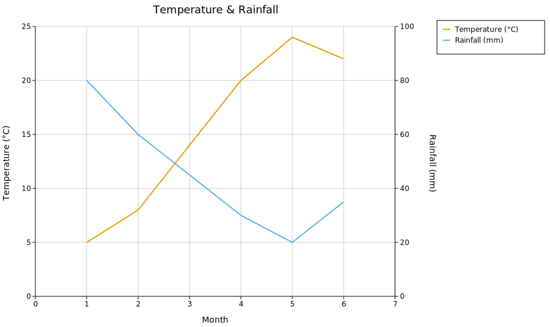
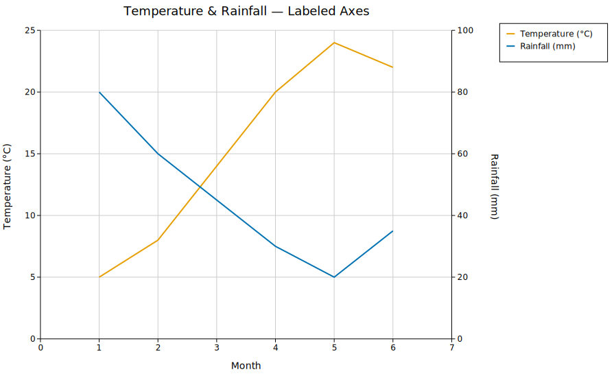
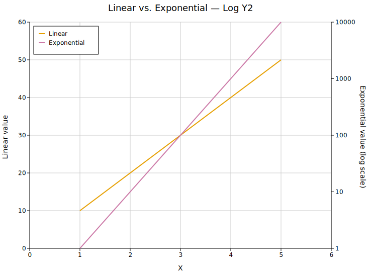
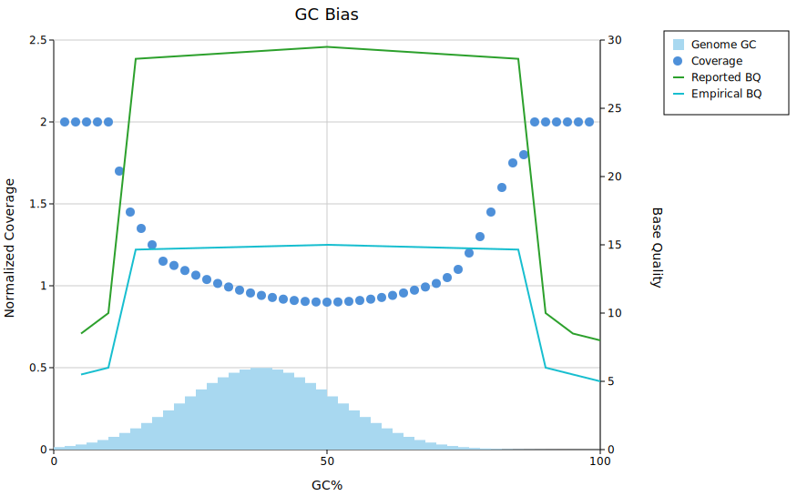

# Twin-Y Plot

A twin-Y (dual-axis) plot renders two independent sets of data on the same x-axis with separate y-axes — the primary axis on the left and the secondary axis on the right. This is useful when two related series have incompatible scales (e.g. temperature in °C and rainfall in mm) or different units that would otherwise force one series into a thin band near zero.

**Render function:** `kuva::render::render::render_twin_y`

---

## Basic usage

Pass two separate `Vec<Plot>` to `render_twin_y` — one for the left axis, one for the right. Use `Layout::auto_from_twin_y_plots` to compute axis ranges for both sides automatically.

```rust,no_run
use kuva::plot::LinePlot;
use kuva::backend::svg::SvgBackend;
use kuva::render::render::render_twin_y;
use kuva::render::layout::Layout;
use kuva::render::plots::Plot;

let temp: Vec<(f64, f64)> = vec![
    (1.0, 5.0), (2.0, 8.0), (3.0, 14.0), (4.0, 20.0), (5.0, 24.0), (6.0, 22.0),
];
let rain: Vec<(f64, f64)> = vec![
    (1.0, 80.0), (2.0, 60.0), (3.0, 45.0), (4.0, 30.0), (5.0, 20.0), (6.0, 35.0),
];

let primary   = vec![Plot::Line(LinePlot::new().with_data(temp).with_legend("Temperature (°C)"))];
let secondary = vec![Plot::Line(LinePlot::new().with_data(rain).with_legend("Rainfall (mm)"))];

let layout = Layout::auto_from_twin_y_plots(&primary, &secondary)
    .with_title("Temperature & Rainfall")
    .with_x_label("Month")
    .with_y_label("Temperature (°C)")
    .with_y2_label("Rainfall (mm)");

let scene = render_twin_y(primary, secondary, layout);
let svg = SvgBackend.render_scene(&scene);
std::fs::write("twin_y.svg", svg).unwrap();
```



The left axis scales to the primary plots only; the right axis scales to the secondary plots only. Both axes share the same x range.

---

## Axis labels and legend

`.with_y_label(s)` labels the left axis; `.with_y2_label(s)` labels the right axis. Both rotate 90° and sit outside their respective tick marks. Legend entries from all plots — primary and secondary — are collected into a single legend.

```rust,no_run
use kuva::plot::{LinePlot, LegendPosition};
use kuva::render::render::render_twin_y;
use kuva::render::layout::Layout;
use kuva::render::plots::Plot;

let primary   = vec![Plot::Line(LinePlot::new().with_data(temp).with_color("#e69f00").with_legend("Temperature (°C)"))];
let secondary = vec![Plot::Line(LinePlot::new().with_data(rain).with_color("#0072b2").with_legend("Rainfall (mm)"))];

let layout = Layout::auto_from_twin_y_plots(&primary, &secondary)
    .with_title("Temperature & Rainfall")
    .with_x_label("Month")
    .with_y_label("Temperature (°C)")
    .with_y2_label("Rainfall (mm)")
    .with_legend_position(LegendPosition::OutsideRightTop);
```



---

## Log scale on the secondary axis

`.with_log_y2()` switches the right axis to a log₁₀ scale. The left axis is unaffected. Useful when the secondary series spans orders of magnitude (e.g. p-values, read counts) while the primary series is linear.

```rust,no_run
# use kuva::render::layout::Layout;
# use kuva::render::plots::Plot;
# use kuva::plot::LinePlot;
let layout = Layout::auto_from_twin_y_plots(&primary, &secondary)
    .with_y2_label("Exponential value (log scale)")
    .with_log_y2();
```



---

## Mixing plot types

Both the primary and secondary `Vec<Plot>` accept any combination of supported plot types. The example below mirrors a typical WGS GC bias QC chart: a precomputed `Histogram` and a `ScatterPlot` on the left (Normalized Coverage), with two `LinePlot`s on the right (Base Quality).

```rust,no_run
use kuva::plot::{LinePlot, LegendPosition};
use kuva::plot::scatter::ScatterPlot;
use kuva::plot::histogram::Histogram;
use kuva::backend::svg::SvgBackend;
use kuva::render::render::render_twin_y;
use kuva::render::layout::Layout;
use kuva::render::plots::Plot;

// Genome GC distribution — precomputed bell-curve histogram (y 0–0.5)
let genome_gc = Plot::Histogram(
    Histogram::from_bins(gc_edges, gc_counts)
        .with_color("#a8d8f0")
        .with_legend("Genome GC"),
);

// Normalized coverage — U-shaped scatter, saturates to 2.0 at extreme GC
let coverage = Plot::Scatter(
    ScatterPlot::new()
        .with_data(coverage_pts)
        .with_color("#4e90d9")
        .with_size(5.0)
        .with_legend("Coverage"),
);

// Base quality lines on the secondary axis (0–40)
let reported = Plot::Line(LinePlot::new().with_data(reported_bq).with_color("#2ca02c").with_legend("Reported BQ"));
let empirical = Plot::Line(LinePlot::new().with_data(empirical_bq).with_color("#17becf").with_legend("Empirical BQ"));

let primary   = vec![genome_gc, coverage];
let secondary = vec![reported, empirical];

let layout = Layout::auto_from_twin_y_plots(&primary, &secondary)
    .with_title("GC Bias")
    .with_x_label("GC%")
    .with_y_label("Normalized Coverage")
    .with_y2_label("Base Quality")
    .with_legend_position(LegendPosition::OutsideRightTop);

let scene = render_twin_y(primary, secondary, layout);
let svg = SvgBackend.render_scene(&scene);
std::fs::write("gc_bias.svg", svg).unwrap();
```



Supported plot types on both axes: `Line`, `Scatter`, `Series`, `Band`, `Bar`, `Histogram`, `Box`, `Violin`, `Strip`, `Density`, `StackedArea`, `Waterfall`, `Candlestick`.

---

## Palette auto-assignment

`.with_palette(palette)` cycles colors across all primary and secondary plots in order, left-to-right through primary then secondary. Attach `.with_legend(s)` to each plot to identify them.

```rust,no_run
# use kuva::render::layout::Layout;
# use kuva::Palette;
let layout = Layout::auto_from_twin_y_plots(&primary, &secondary)
    .with_palette(Palette::wong());
```

---

## Manual axis ranges

The auto-computed ranges can be overridden independently for each axis:

```rust,no_run
# use kuva::render::layout::Layout;
let layout = Layout::auto_from_twin_y_plots(&primary, &secondary)
    .with_y_axis_min(0.0).with_y_axis_max(2.0)   // left axis
    .with_y2_range(0.0, 40.0);                    // right axis
```

---

## API reference

| Method | Description |
|--------|-------------|
| `render_twin_y(primary, secondary, layout)` | Render a twin-y scene; returns a `Scene` |
| `Layout::auto_from_twin_y_plots(primary, secondary)` | Compute axis ranges for both sides automatically |
| `.with_y_label(s)` | Left (primary) axis label |
| `.with_y2_label(s)` | Right (secondary) axis label |
| `.with_y2_label_offset(dx, dy)` | Nudge the right axis label position in pixels |
| `.with_log_y2()` | Log₁₀ scale on the secondary axis |
| `.with_y2_range(min, max)` | Override the secondary y-axis range |
| `.with_y2_tick_format(fmt)` | Tick format for the secondary axis |
| `.with_palette(palette)` | Auto-assign colors across all primary + secondary plots |
